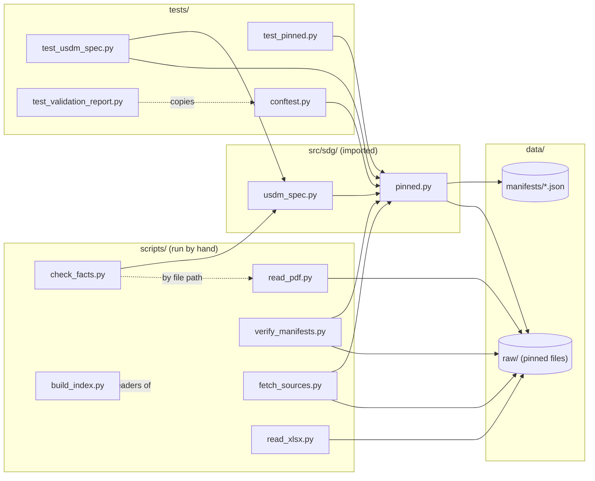

# Code map

What calls what. One box per Python file in `scripts/`, `src/sdg/` and `tests/`, with `data/` as the layer underneath. An arrow means "uses": an import, or reading a folder. Kept by hand; update it when a file is added or an import changes. Correct as of 2026-09-04.

## Each arrow, in words

| From | To | What for |
| --- | --- | --- |
| `usdm_spec.py` | `pinned.py` | Obtains the verified `dataStructure.yml` (and the repo root) before parsing it. The only path by which the loader touches disk. |
| `fetch_sources.py` | `pinned.py` | The manifest reader, the hashing function and the repo root, so a download is verified with the same code the pipeline uses. |
| `verify_manifests.py` | `pinned.py` | The manifest reader, the per-entry check and the folder locations. The script keeps only the corpus walk and the printed report. |
| `check_facts.py` | `usdm_spec.py` | Re-derives the concrete-class count (80) through the loader rather than parsing the file itself. |
| `check_facts.py` | `read_pdf.py` | Loads it by file path (`importlib`) to count IG sections. The one remaining by-file-path import in the repo, the pattern removed from `usdm_spec.py` on 2026-09-04; it works because both files are in `scripts/`. |
| `pinned.py` | `data/manifests/` | Reads every manifest to find a file's entry. |
| `pinned.py` | `data/raw/` | Hashes the file named, read-only. |
| `fetch_sources.py` | `data/raw/` | The one writer: downloads missing files into place after verifying them. |
| `verify_manifests.py` | `data/raw/` | Walks it for files no manifest records. |
| `read_pdf.py`, `read_xlsx.py` | `data/raw/` | Open the pinned PDFs and workbooks to print parts of them. Each locates the repo on its own (walks up from its file), the same assumption `pinned.py` makes. |
| `build_index.py` | `scripts/*.py` | Reads each script's header block and writes `scripts/README.md`. |
| `test_usdm_spec.py` | `usdm_spec.py`, `pinned.py` | Checks the loader; points `pinned.py` at a temporary manifests folder for the failure cases. |
| `test_pinned.py` | `pinned.py` | Checks every way obtaining a pinned file can succeed or fail. |
| `conftest.py` | `pinned.py` | The two shared fixtures that stage a temporary manifest. |
| `test_validation_report.py` | `conftest.py` | Copies it into throwaway suites to prove the record-writer. |

## What is not on the map

- `read_pdf.py`, `read_xlsx.py` and `build_index.py` import nothing from the repo. They are leaves.
- `check_facts.py` also reads the project's Markdown (`README.md`, `BACKGROUND.md`, `docs/`) to find the figures it re-derives.
- Third-party libraries (`yaml`, `fitz`, `openpyxl`, `httpx`, `pytest`) are omitted; `environment.yml` lists them.
