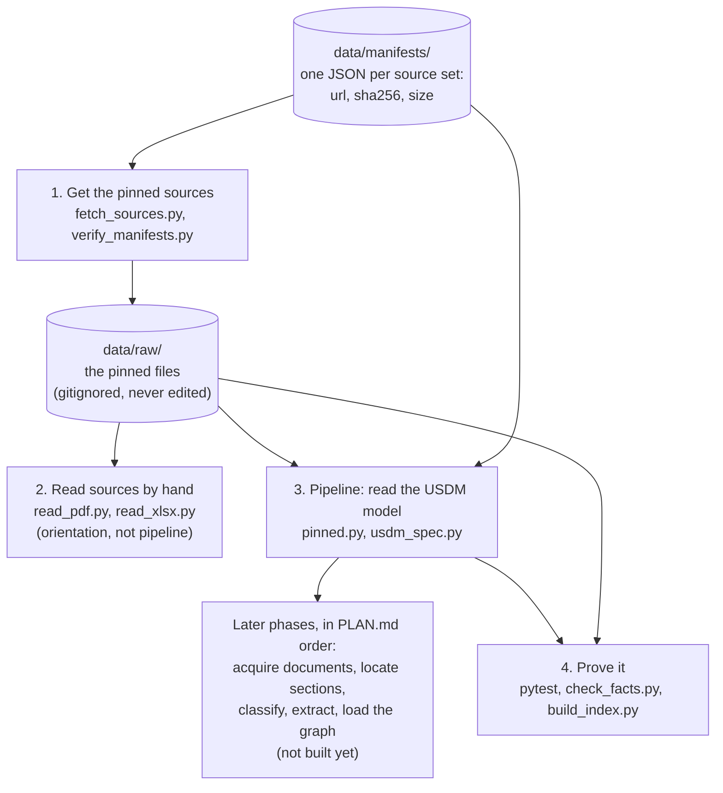
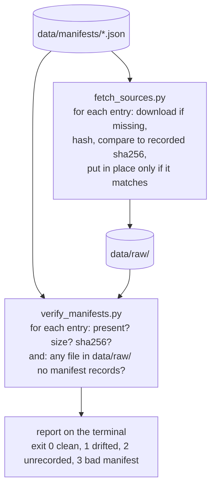
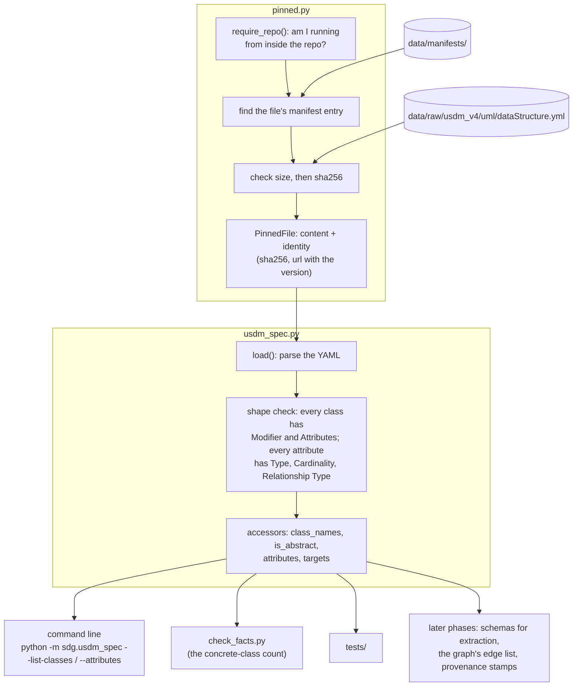
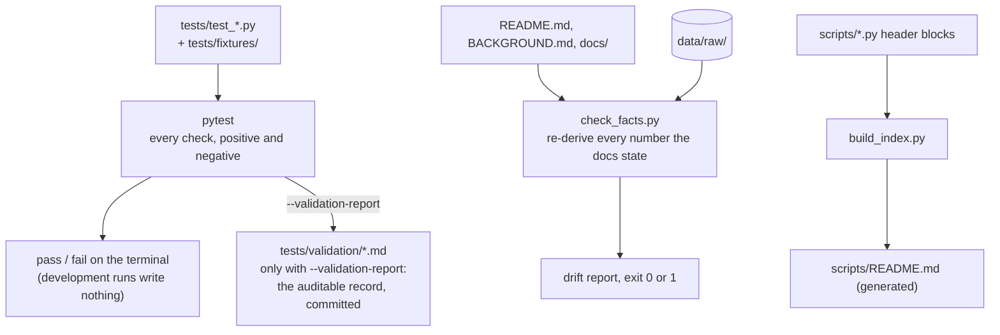

# Code map

How the code runs: the order of steps, and what each step produces for the next. One high-level workflow first, then one detail sheet per step that has enough inside it to need one. Arrows are files or folders flowing from one step to the next, not imports. A table of imports (what depends on what) is at the bottom for reference. Kept by hand; update it when a step or a file is added. Correct as of 2026-09-04.

## The workflow

Step 2 is a side branch: a person runs those two scripts to look at a standard while working; nothing downstream consumes their output. Steps 1, 3 and 4 each have a sheet below.

## Sheet 1. Get the pinned sources

Once per machine, and again whenever a manifest changes. Everything the project reads is downloaded here, verified against its recorded fingerprint, and never edited afterwards.

Both scripts use the same manifest-reading and hashing code, which lives in `src/sdg/pinned.py` (sheet 3), so the check run by hand here is the check the pipeline runs automatically.

## Sheet 3. Pipeline: read the USDM model

The only pipeline step built so far. Everything that needs a fact about USDM goes through `usdm_spec.py`, and everything that needs a pinned file goes through `pinned.py`.

Every failure has its own exit code and message: file missing (1), cannot be verified or does not match (3), wrong shape (4), unknown class (5), not running from inside the repo (6). If a source ever comes from an API instead of a manifest, the inside of `pinned.py` changes and nothing to its right does.

## Sheet 4. Prove it

Three separate proofs, run by hand. None feeds the pipeline; each guards something the pipeline or the documents claim.

## Reference: what imports what

For "if I change this file, what else is affected". Third-party libraries omitted; `environment.yml` lists them.

| File | Imports from the repo | For |
| --- | --- | --- |
| `src/sdg/usdm_spec.py` | `sdg.pinned` | the verified model file and the repo root |
| `scripts/fetch_sources.py` | `sdg.pinned` | manifest reading, hashing, repo root |
| `scripts/verify_manifests.py` | `sdg.pinned` | manifest reading, per-entry check, folder locations |
| `scripts/check_facts.py` | `sdg.usdm_spec`; `read_pdf.py` (by file path, same folder) | the class count; the registered-PDF table |
| `scripts/read_pdf.py`, `read_xlsx.py`, `build_index.py` | nothing | leaves |
| `tests/test_usdm_spec.py` | `sdg.usdm_spec`, `sdg.pinned` | the loader; a temporary manifests folder for failure cases |
| `tests/test_pinned.py` | `sdg.pinned` | every success and failure case |
| `tests/conftest.py` | `sdg.pinned` | the two shared manifest-staging fixtures |
| `tests/test_validation_report.py` | `conftest.py` (copied into throwaway suites) | the record-writer |
